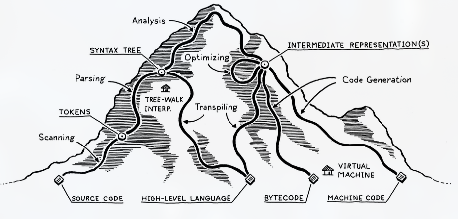
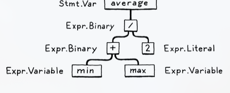

# A Map of the Territory
This book is about a language's *implementation*

You can visualize the network of paths an implementation may choose as climbing a mountain. The bottom represents raw source text. Each phase anaylzes the program and traforms it to some higher-level representation. 

Once we reach the peak, this means we can see what their code *means*. Then, we descent down the other side of the mountain, where we transform the higher-level representation down to a lower-level, getting closer to something the CPU may execute. 



Let's do an example: `v` `a` `r` `a` `v` `e` `r` `a` `g` `e` `=` `(` `m` `i` `n` `+` `m` `a` `x` `)` `/` `2` `;`

## The Parts of a Language
### Scanning
The first step is **scanning**, also known as **lexing** or **lexical analysis**. It makes sense of the linear stream of characters, and puts them together, called a **token**. Some tokens are `(`, `,`, `123`, `"hi!"` or `min`

Thus, our example after being scanned will look like: `var` `average` `=` `(` `min` `+` `max` `)` `/` `2` `;`

### Parsing
This is where the syntax gets a **grammar**. Similar to diagramming sentences in English class.

The parser takes the flat sequence of tokens and builds a tree structure that mirrors the nested nature of the grammar. Can be called **parse tree** or **abstract syntax tree**, depending on how close to the  bare syntactic structure of the source language they are. 



Think of linguistics here. Also note that it is the **parser's job to report syntax errors**

### Static Analysis
This is where the individual characteristics of each language occurs. 

For example, in an expression like `a + b`, we know that we are adding `a` and `b`, but we don't know what those variables refer to. Local? Global? Where are they defined?

The first bit of analysis that most languages do is called **binding** or **resolution**. For each **identifier**, we find out where that name is defined and wire the two together. This is where **scope** comes into play - the region of source code where a certain name can be used to refer to a certain declaration. 

If the language is statically typed, this is when we type check. 

We are now at the peak of the mountain. All this insight that is visible to us from analysis needs to be stored somwhere:
- Often, it gets stored right back as **attributes** on the syntax tree itself - extra fields in the nodes that aren't initialized during parsing but get filled in later
- Store in a lookup table off to the side, known as a **symbol table**. The key would be the variable and declaration. 
- The most powerful is to transform the tree into a different data structure that suits the semantics of the code. (Next section) 

Everything up to here is considered the **front end** of the implementation. 

Next sections will be the **middle end**.

### Intermediate Representations
The compiler can be thought of as a pipeline, where each stage's job is to organize the data representing the user's code in a way that makes the next stage simpler to implement. The front end (of the pipeline) is specific to the source language the program is written in. The back end is concerned with the final architecture where the program will run. 

In the middle, the compiler may store the code in some intermediate representation (IR). This simply acts as the middleware between the front and end of the pipeline. 

This allows generability. For example, suppose we want to implement Pascal, C, and Fortran compliers, and we are targeting x86 and ARM. Normally, this would mean we would have to write 6 full compilers (every combination).

A shared intermediate representation reduces dramatcally. Now, we write one front end for each source language that produces the IR, and one back end for each target architecture.

This becomes $O(n*m)$ vs $O(n+m)$ where $n$ represents the number of langauges and $m$ represents the number of architectures.

### Optimization
Once we understand what the user's program means, we can then further optimize it. 

A simple example is **constant folding**: if some expression always evalutes to the exact same value, we can do the evaluation at **compile time** and replace the code for the expression with its result. For example:
```ocaml
let expression = 3.14158 * (0.75 / 2) * (0.75 / 2);;
```

we could do all of that arithmetic in the compiler and change the code to:
```ocaml
let expression = 0.4417860938;;
```

This book will not cover optimization. Note that many successful languages have few compile-time optimizations. For example, Lua and CPython. 

### Code generation
After optimizations, the last step is to convert the user code into machine readable code. This is called **code gen**. 

We are now in the **back end**, meaning our representation of the code becomes more and more primitive, as we get closer to something our simple-minded machine can understand.

From here, we need to make a decision. Do we generate instructions for a real CPU or a virtual one?

A real machine code, we get an executable that the OS can load directly into the chip, which is really fast. The downside is that generating it is a lot of work. As well, the compiler is tied to the specific architecture. Today's architectures have piles of instructions and complex pipelines. 

To get around this, hackers made their compilers produce virtual machine code, meaning they produced code for a hypothetical, idealized machine. Today, we call it **bytecode** because each instruction is often a single byte long.

### Virtual Machine
If your compiler produces bytecode, then you would have to translate it, since there is no chip that speaks bytecode. From here, you have 2 options:
1. Write a mini-compiler for each target architecture that converts the bytecode to native code for that machine. Pretty simple since you get to reuse the rest of the compiler pipeline across all of the machines supported. Basically using the bytecode as an intermediate representation.
2. Write a **virtual machine**, a program that emulates a hypothetical chip supporting your vm at runtime. Running bytecode in VM is slow, because every instruction must be simulated at runtime each time it executes. In return, you get simplicity and portability. 

### Runtime
After we format the user's program into a form that we can execute, the last step is running it. If we compiled it to machine code, we simply tell the operating system to load the executable. If we compiled it to bytecode, we need to start up the VM and load the program into that.

Typically, we need some services that our language provides while the program is running. For example, if the language automatically manages memory, we need a garbage collector. 

If a fully compiled language, the code implementing the runtime gets inserted directly into the resulting executable. If the language is run inside an interpreter or VM, then the runtime lives there. 

## Shortcutes and Alternate Routes
The section before is the long path covering every possible phase that could be implemented. Many languages do every possible phase, but there exists shortcuts and alternate paths.

### Single-pass compilers
As soon as you see some expression, you need to know enough to correctly compile.

Pros: Saves memory
Cons: Restricts the design of the language

C was designed around this limitiation, because at that time, memory was so limited that a compiler might not even be able to hold an entire *source* file in memory. It's why in C you can't call a function above the code that defines it, unless you have an explicit forward declaration.

### Tree-walk interpreters
Some languages begin executing code right after parsing the abstract syntax tree. The interpreter traverse the syntax tree one branch and leaf at a time, evaluating each node as it goes. 

Pros: Simple? common in student projects and little languages
Cons: Slow

This is what we'll build at first.

### Transpilers
The idea is that instead of doing all the work to lower the semantics to some primitive target language, you produce a string of valid source code for some other language that's about as high level as yours. Then, you use the already existing compilation tools for that language as a shortcut. 

Used to be called *source-to-source compiler* or a *transcompiler*. Nowadays its called a *transpiler*.

### Just-in-time compilation
Less of a shortcut and best reserved for experts. The fastest way to execute code is by compiling it to machine code, but you might not know what architecture your end user's machine supports. What to do?

On the end user's machine, when the program is loaded -- either from source in the case of JS -- you combile it to native code for the architecture their computer supports. 

The most sophisticated JITs insert profiling hooks into the generated code to see which regions are performance critical and what kind of data flows through them. Then, over time, they will automatically recombile those hot spots with more advanced optimizations.

## Compilers and Interpreters
